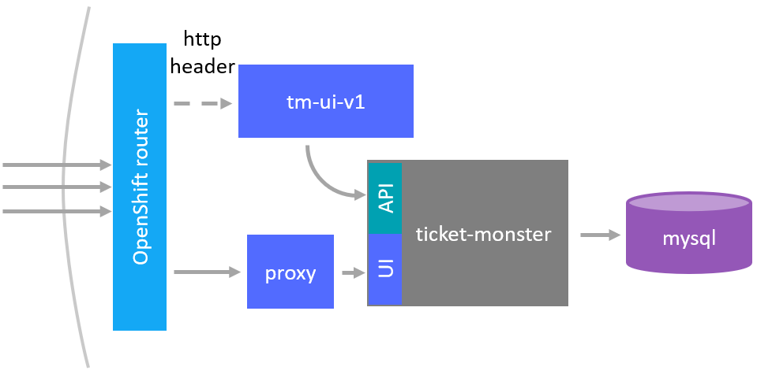
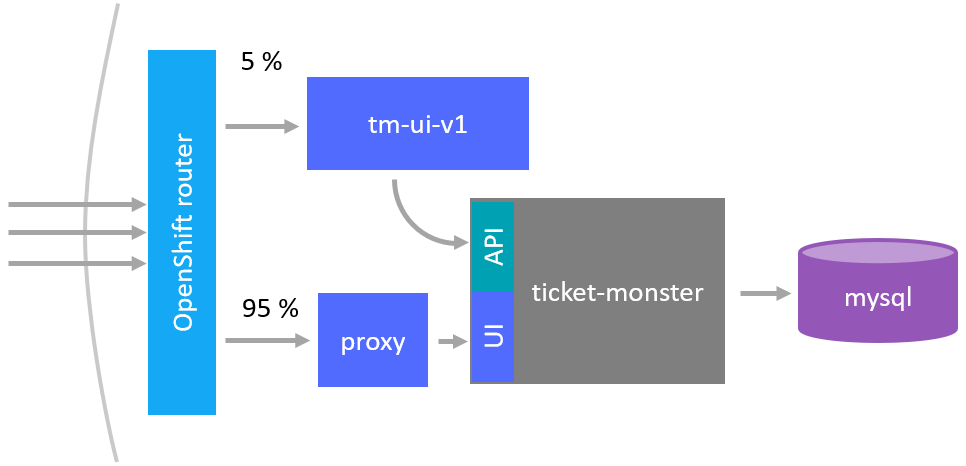

## Ticket Monster UI-V1

The purpose of this sub-project is to deploy it next to the ```monolith/``` project to show how this UI can directly communicate with the monolith.


## Start this project
Use the image provided by this project
```
oc new-app --docker-image=jetzlstorfer/ticket-monster-ui-v1:latest
```
or build the project by yourself and push it to docker
```
docker build . -t <YOURDOCKER>/ticket-monster-ui-v1:latest
docker push <YOURDOCKER>/ticket-monster-ui-v1:latest
oc new-app --docker-image=<YOURDOCKER>/ticket-monster-ui-v1:latest
```

## Make it publicly available
Expose the service in OpenShift
```
oc expose service ticket-monster-ui-v1 --name=ui-v1
```

## Configuration

In ```httpd.conf``` the redirect to the monolith was inserted as a proxy. This proxy helps us keep friendly URLs even when there are composite UIs or composite microservice REST APIs. It also helps us avoid tripping the browser Same Origin policy. We use a simple HTTP server (apache) to serve the static content and then use the reverse proxy plugins to proxy REST calls to the appropriate microservice:


```conf
# get rid of some headers (needed for dark-launch feature)
RequestHeader unset Cbr-Header

# proxy to redirect to the monolith
ProxyPass "/rest" "http://<YOURURL>/rest"
ProxyPassReverse "/rest" "http://<YOURURL>/rest"
```

In contrast to the [original project](https://github.com/ticket-monster-msa/monolith) the base image in the ```Dockerfile``` was changed from httpd:2.4 to centos/httpd-24-centos7 in order to work in OpenShift smoothly.


## Dark launch
The technical realisation is inspired by this blog post: https://blog.openshift.com/ocp-custom-routing/

The route for the service is already exposed as seen above. We have to annotate the route so we can route there regardless of the URL the user enters in his browser.

Annotation for the route you want to have the dark launch for
```
oc annotate route -n <YOURNAMESPACE> <YOURROUTE> haproxy.router.openshift.io/cbr-header=ui-v1
```

It should now look similar to:
```yaml
apiVersion: route.openshift.io/v1
kind: Route
metadata:
  annotations:
    haproxy.router.openshift.io/cbr-header: ui-v1
    ...
```

### Edit haproxy config template
Copy and edit the file haproxy-config.template from the home folder of your router-pod and edit the ```frontend public``` section to enable the header based routing. More information here: https://docs.openshift.com/container-platform/3.9/install_config/router/customized_haproxy_router.html#obtaining-router-configuration-template 

Insert the following section:
```template
  # Custom snippet for balancing through HTTP headers
  {{- range $cfgIdx, $cfg := .State }}
  {{- if (ne (index $cfg.Annotations "haproxy.router.openshift.io/cbr-header") "") }}
  acl custom_header_{{index $cfg.Annotations "haproxy.router.openshift.io/cbr-header"}} hdr_sub(cbr-header) {{index $cfg.Annotations "haproxy.router.openshift.io/cbr-header"}}
  use_backend be_http:{{$cfgIdx}} if custom_header_{{index $cfg.Annotations "haproxy.router.openshift.io/cbr-header"}}
  {{- end }}
  {{- end }}
```

Your result should look something like this:
```template
frontend public
    {{ if eq "v4v6" $router_ip_v4_v6_mode }}
  bind :::{{env "ROUTER_SERVICE_HTTP_PORT" "80"}} v4v6
    {{- else if eq "v6" $router_ip_v4_v6_mode }}
  bind :::{{env "ROUTER_SERVICE_HTTP_PORT" "80"}} v6only
    {{- else }}
  bind :{{env "ROUTER_SERVICE_HTTP_PORT" "80"}}
    {{- end }}
    {{- if isTrue (env "ROUTER_USE_PROXY_PROTOCOL") }} accept-proxy{{ end }}
  mode http
  tcp-request inspect-delay 5s
  tcp-request content accept if HTTP

  {{- if (eq .StatsPort -1) }}
  monitor-uri /_______internal_router_healthz
  {{- end }}

  # Custom snippet for balancing through HTTP headers
  {{- range $cfgIdx, $cfg := .State }}
  {{- if (ne (index $cfg.Annotations "haproxy.router.openshift.io/cbr-header") "") }}
  acl custom_header_{{index $cfg.Annotations "haproxy.router.openshift.io/cbr-header"}} hdr_sub(cbr-header) {{index $cfg.Annotations "haproxy.router.openshift.io/cbr-header"}}
  use_backend be_http:{{$cfgIdx}} if custom_header_{{index $cfg.Annotations "haproxy.router.openshift.io/cbr-header"}}
  {{- end }}
  {{- end }}
```

Create a custom mapping and set the environment variable for this template file, more information here: https://docs.openshift.com/container-platform/3.9/install_config/router/customized_haproxy_router.html#using-configmap-replace-template

```
oc create configmap customrouter --from-file=haproxy-config.template

oc volume dc/router --add --overwrite \
    --name=config-volume \
    --mount-path=/var/lib/haproxy/conf/custom \
    --source='{"configMap": { "name": "customrouter"}}'
oc set env dc/router \
    TEMPLATE_FILE=/var/lib/haproxy/conf/custom/haproxy-config.template
```

###


### Test your dark launch
A simple curl should reveal that you are hitting the new version of the UI although you are targeting the normal ```prod-m2m``` frontend URL.

```sh
curl --header "Cbr-Header: ui-v1" http://production-m2m.<YOURURL>
```

The following figure shows this approach from a conceptual point of view:




## Canary deployment of tm-ui-v1

We edit the route which we created in the ```monolith-proxy``` sub-project where we want to have 95&nbsp;% of the traffic hitting the original monolith-proxy service and only 5&nbsp;% of the overall traffic to be routed to the ticket-monster-ui-v1 service.

```
oc set route-backends production monolith-proxy=95 ticket-monster-ui-v1=5
```

The following figure shows this approach from a conceptual point of view:

